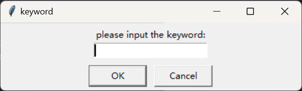
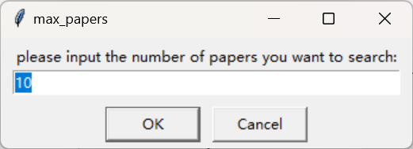
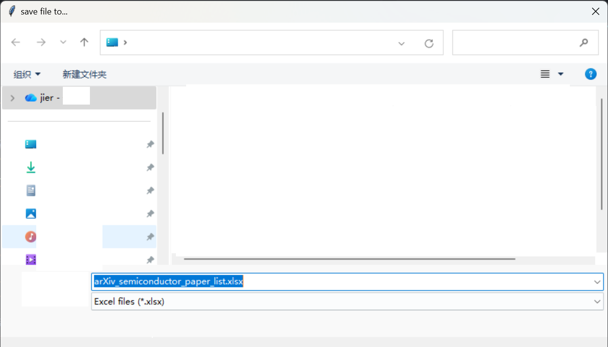
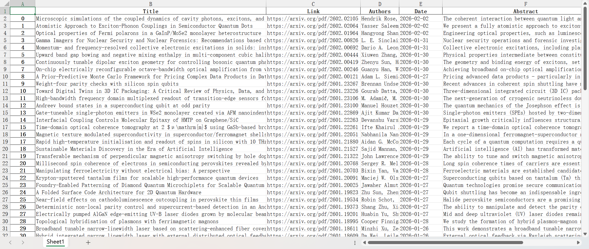

# arXiv pps-info-get-tool(soeasy)🦤 

arXiv pps-info-get-tool食用指南🦤 

### what's this

从arxiv官网上检索关键词——>获得论文标题、作者、pdf链接

easy get papers' information from https://arXiv.org, including title, authors, abstract, and pdf's link...🦤


## 1. Environment Prepare

```powershell
pip install requests

pip install beautifulsoup4

pip install pandas

pip install openpyxl

# choosable
pip install lxml
```

## 2. RUN

input keywords:



input numbers of papers you want:



## 3. Save path settings

save path to:...




## 4. Result

a few seconds later...

running result: 


